
 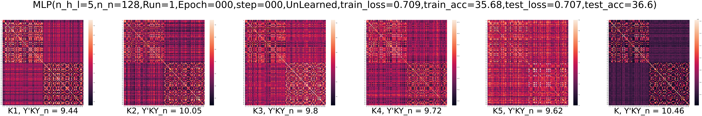 

  

 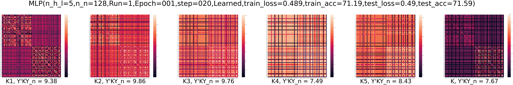 

 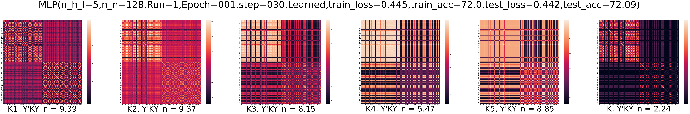 

 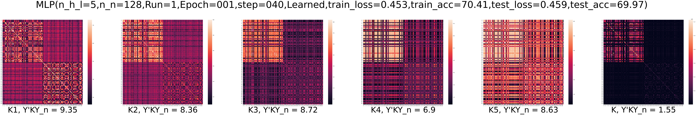 

 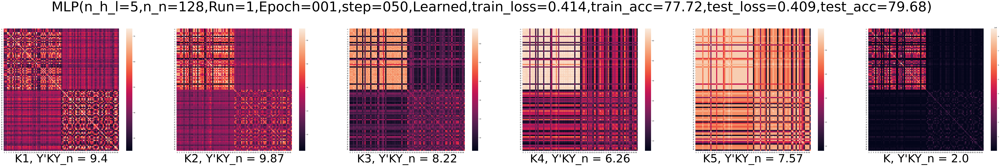 

 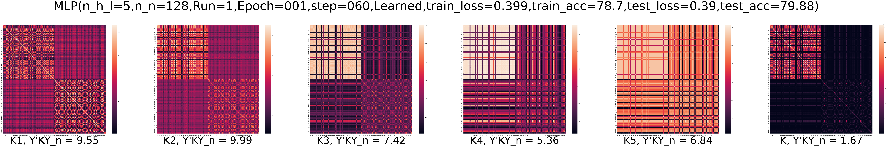 

 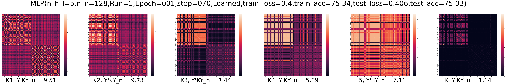 

 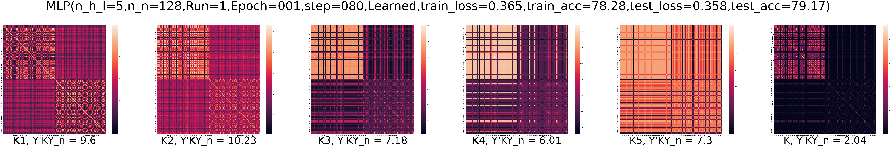 

 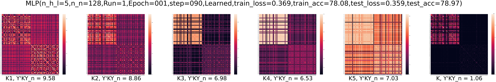 

  

 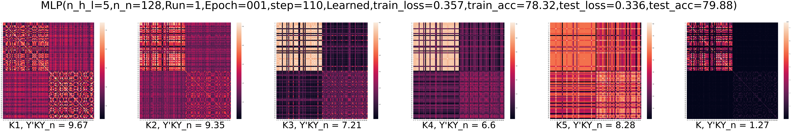 

 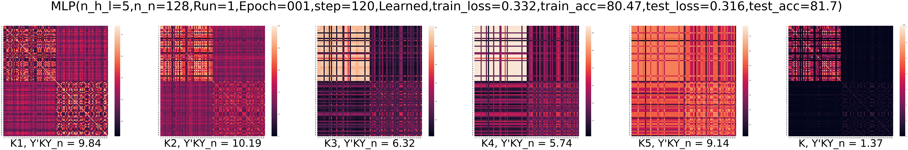 

  

 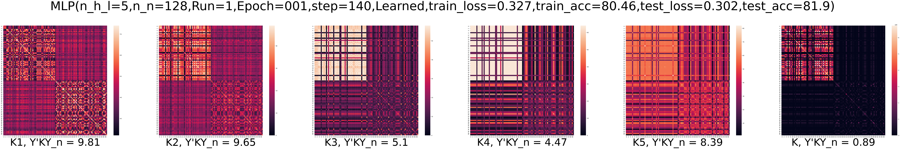 

 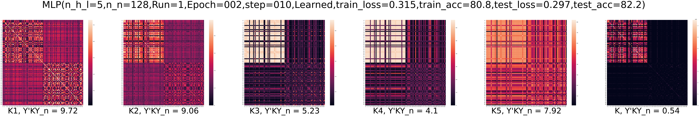 

  

 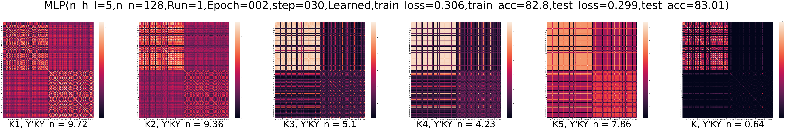 

 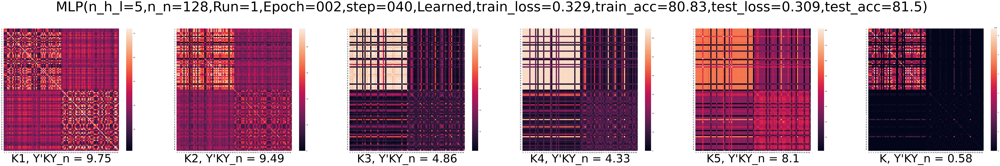 

 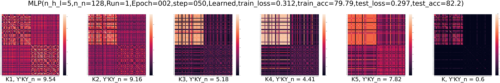 

 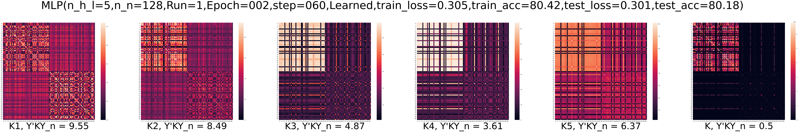 

  

  

 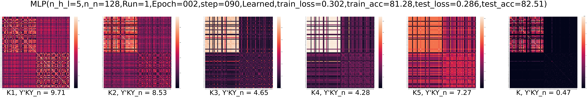 

 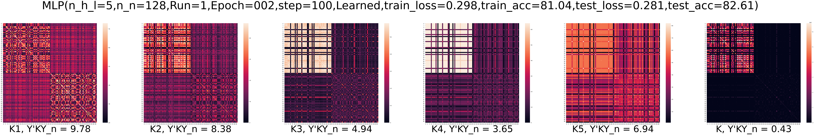 

 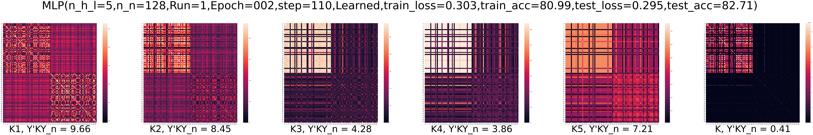 

  

 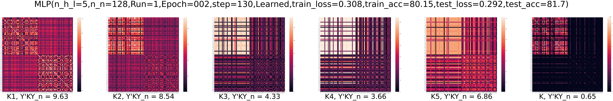 

  

 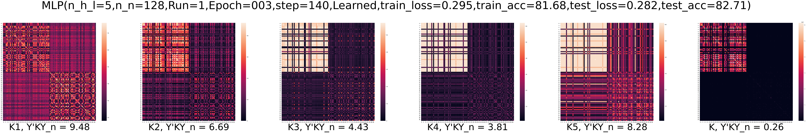 

 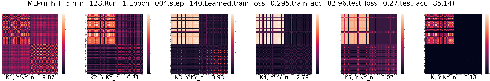 

  

  

 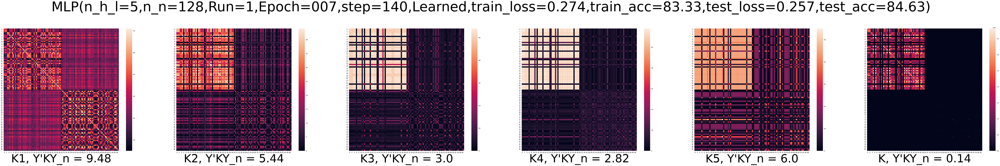 

  

 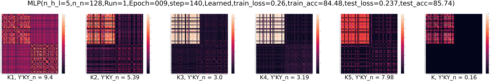 

  

 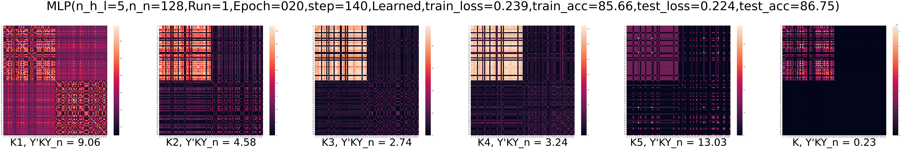 

 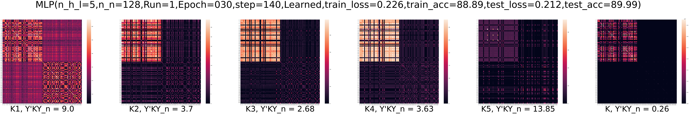 

 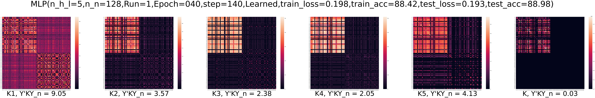 

 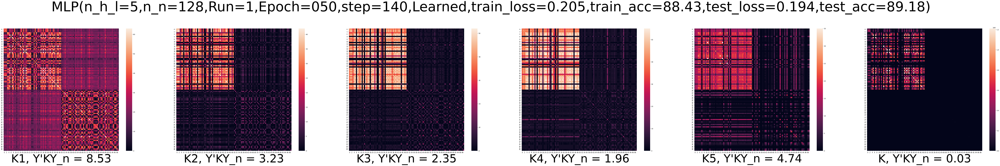 

 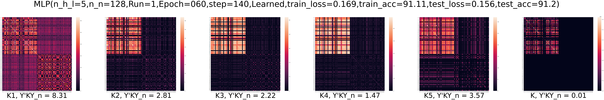 

 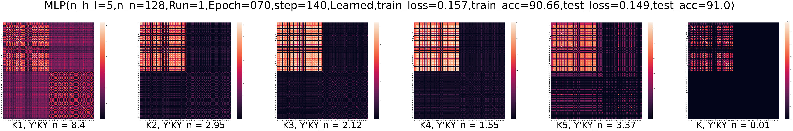 

 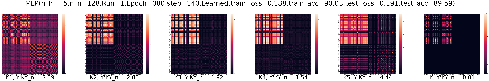 

  

 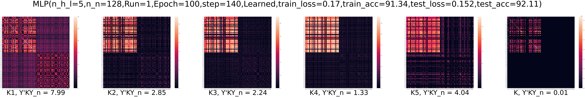 

 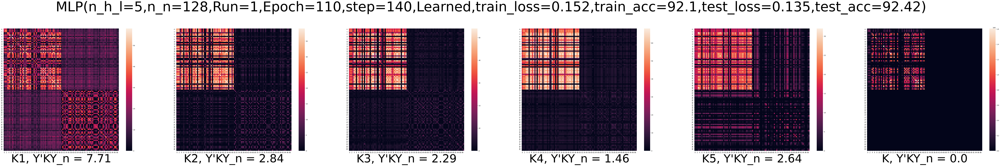 

 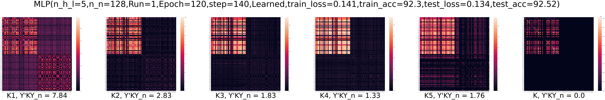 

 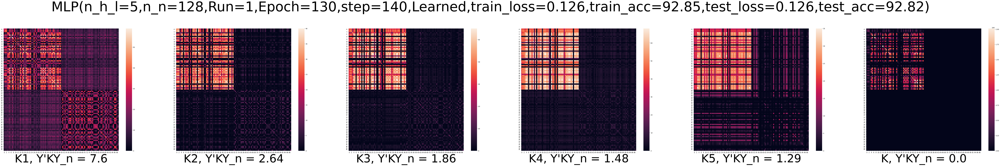 

 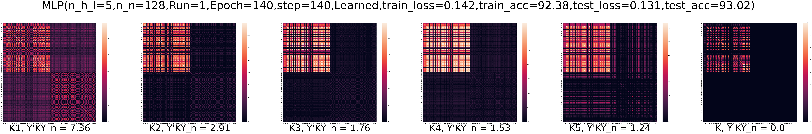 

 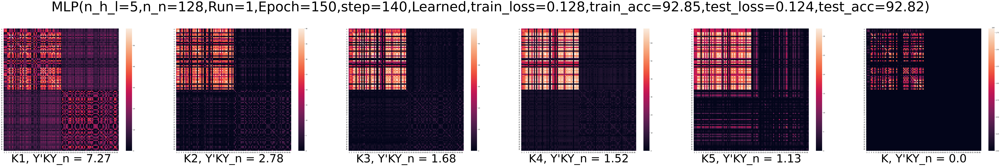 

 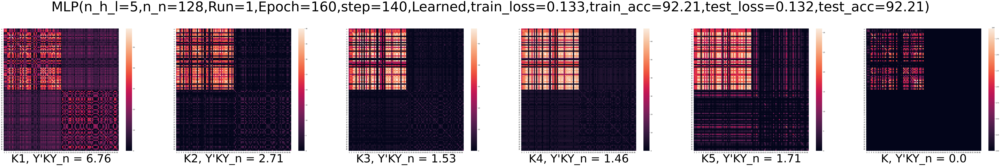 

 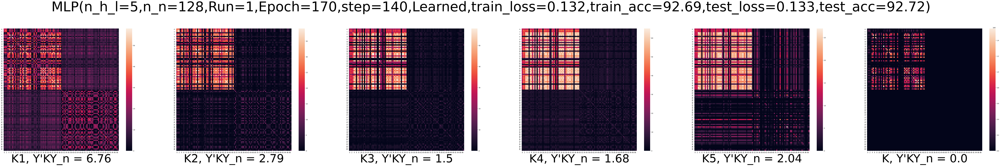 

 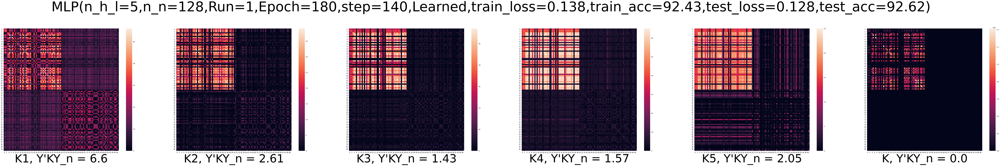 

  

 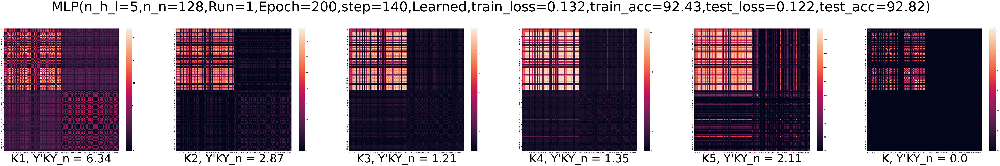 

 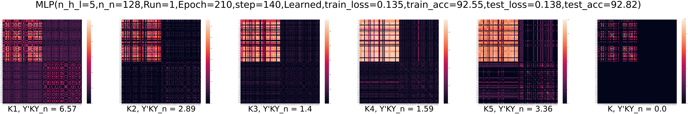 

 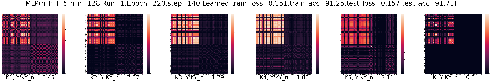 

 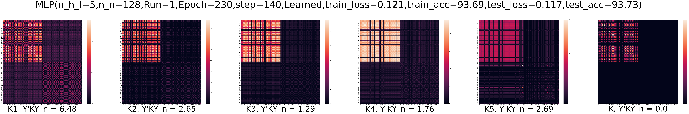 

 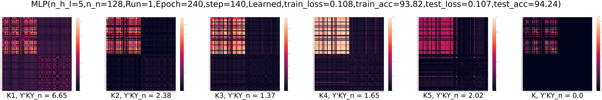 

 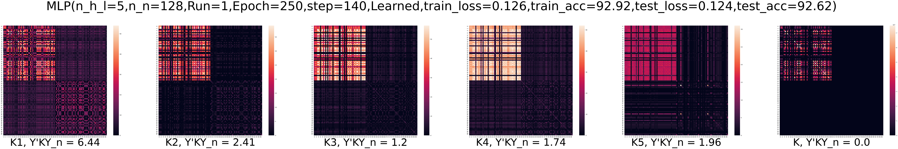 

